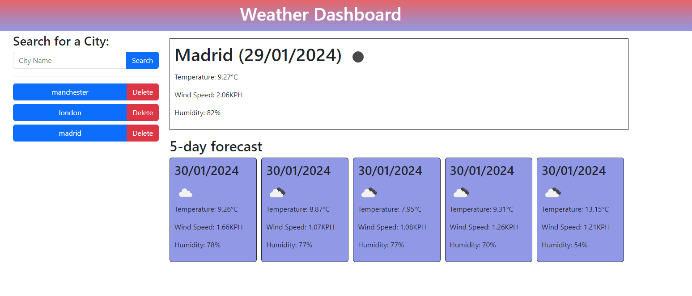

# Weather_Dashboard

# Daily_Planner

## Table of Contents

- [Description](#description)
- [Features](#features)
- [User Acceptance Criteria](#user-acceptance)

# Description 

We have created a weather application that allows users to search for the current weather by searhing a city name and a 5-day forecast for any location. The main features include:

Search History: The application stores search history locally, allowing users to quickly access past search queries. The search history is displayed as buttons, making it easy for users to revisit previous searches.

Current Weather Display: Users can search for the current weather by entering a location. Upon submitting the search, the application retrieves and displays the current temperature, wind speed, humidity, and an icon representing the weather condition.

5-Day Forecast: In addition to the current weather, users can view a 5-day forecast for the searched location. The forecast includes details such as temperature, wind speed, humidity, and weather icons for each day.

Search History Management: Users can manage their search history by deleting individual entries. Clicking the "Delete" button next to a search history item removes it from the search history and localStorage.

Overall, the application provides a convenient way for users to check the current weather and forecast for any location, with the added functionality of storing and managing search history for quick access.

## User Story

AS AN employee with a busy schedule
I WANT to add important events to a daily planner
SO THAT I can manage my time effectively

## User Acceptance Criteria

- Create a weather dashboard with form inputs.

- When a user searches for a city they are presented with current and future conditions for that city and that city is added to the search history.

- When a user views the current weather conditions for that city they are presented with:

- The city name

- The date

- An icon representation of weather conditions

- The temperature

- The humidity

- The wind speed

- When a user views future weather conditions for that city they are presented with a 5-day forecast that displays:

- The date

- An icon representation of weather conditions

- The temperature

- The humidity

- When a user clicks on a city in the search history they are again presented with current and future conditions for that city.

## Mock-Up

The following animation demonstrates the application functionality:

## Screenshot(s)

## Repository Setup Instructions
### 1. Clone the Repository:
- git clone https://github.com/khubaibshah786/Weather_Dashboard

### 5. Deploy to GitHub Pages:
After completing my Currency Compass project, we deployed it to GitHub Pages for public access.

### Technologies Used
- HTML
- jQuery
- CSS

 ## Deployed application

 - Click here [Live Site](https://khubaibshah786.github.io/Weather_Dashboard).